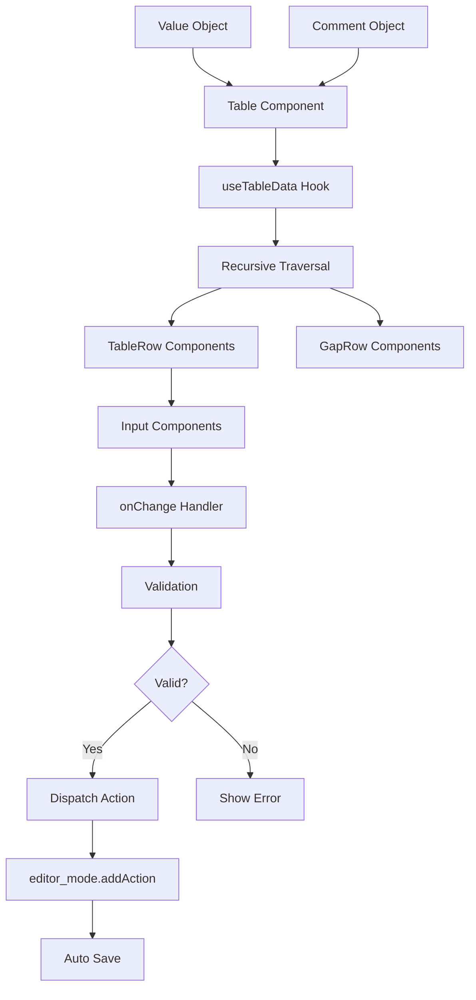

# Design Document: Editor Table React Component

## Overview

本设计文档描述将 `editor_table.ts` 重构为 React 组件的架构设计。新组件将放置在 `src/components/Table` 目录下，采用 React 函数组件 + Hooks 的方式实现，保持与现有编辑器系统的兼容性。

## Architecture

### 组件层次结构

```
src/components/Table/
├── index.tsx                 # 主入口，导出所有公共组件和类型
├── types.ts                  # TypeScript 类型定义
├── context/
│   └── TableContext.tsx      # Table 上下文（包含折叠状态、数据、回调等）
├── stores/
│   ├── index.ts              # mergeStore 组合 FoldStore + DataStore
│   ├── FoldStore.ts          # 折叠状态 store
│   └── DataStore.ts          # 表格数据 store
├── hooks/
│   ├── useFold.ts            # 折叠状态 Hook（从 context 读取）
│   └── useTableNode.ts       # 获取单个节点数据的 Hook
├── components/
│   ├── Table.tsx             # 主表格组件（提供 Context）
│   ├── TableHeader.tsx       # 表格头部组件
│   ├── TableBody.tsx         # 表格主体（递归渲染树）
│   ├── TableRow.tsx          # 表格行组件（叶节点）
│   ├── GapRow.tsx            # 分隔行组件（非叶节点）
│   ├── ActionButtons.tsx     # 操作按钮组件
│   └── inputs/
│       ├── TextareaInput.tsx # 文本域输入
│       ├── SelectInput.tsx   # 下拉选择输入
│       ├── CheckboxInput.tsx # 复选框输入
│       ├── CheckboxSet.tsx   # 复选框组输入
│       └── index.ts          # 输入组件导出
└── utils/
    ├── fieldPath.ts          # 字段路径处理工具
    ├── validation.ts         # 值验证工具
    └── traversal.ts          # 对象遍历工具
```

### 数据流



### 组件生命周期管理

使用 React 的方式处理组件实例隔离，而非原有的 `tableId` 机制：

1. **组件卸载清理**: 使用 `useEffect` 的清理函数，在组件卸载时取消未完成的操作
2. **状态隔离**: 每个 Table 组件实例维护自己的状态，通过 React 的组件树自然隔离
3. **事件处理**: 事件处理函数通过闭包绑定到当前组件实例，无需额外的 ID 检查

## Components and Interfaces

### 主要组件接口

```typescript
// Table.tsx - 主表格组件
interface TableProps {
  /** 数据对象 */
  data: Record<string, unknown>;
  /** 注释配置对象 */
  commentObj: CommentObject;
  /** 值变更回调 */
  onValueChange?: (field: string, value: unknown) => void;
  /** 添加项回调 */
  onAddItem?: (field: string, id: string) => void;
  /** 删除项回调 */
  onDeleteItem?: (field: string) => void;
}

// TableRow.tsx - 表格行组件
interface TableRowProps {
  /** 字段路径 */
  field: string;
  /** 字段短名称 */
  shortField: string;
  /** 当前值 */
  value: unknown;
  /** 字段配置 */
  config: FieldConfig;
  /** 值变更回调 */
  onChange: (value: unknown) => void;
  /** 双击回调 */
  onDoubleClick?: () => void;
}

// GapRow.tsx - 分隔行组件
interface GapRowProps {
  /** 字段路径 */
  field: string;
  /** 子节点内容 */
  children: React.ReactNode;
}

// useFold.ts - 折叠状态 Hook
interface UseFoldReturn {
  /** 当前字段是否折叠 */
  isFolded: boolean;
  /** 切换折叠状态 */
  toggleFold: () => void;
}

// TableContext - Table 上下文
interface TableContextValue {
  /** 树形表格数据 */
  rootNodes: TableNode[];
  /** 所有可折叠的字段路径 */
  gapFields: string[];
  /** 已折叠的字段路径集合 */
  foldedFields: Set<string>;
  /** 切换指定字段的折叠状态 */
  toggleFold: (field: string) => void;
  /** 折叠所有字段 */
  foldAll: () => void;
  /** 展开所有字段 */
  unfoldAll: () => void;
  /** 值变更回调 */
  onValueChange: (field: string, value: unknown) => void;
  /** 添加项回调 */
  onAddItem: (field: string, id: string) => void;
  /** 删除项回调 */
  onDeleteItem: (field: string) => void;
}

// useTableData.ts - 表格数据处理 Hook
interface TableNode {
  /** 唯一标识 */
  id: string;
  /** 字段路径 */
  field: string;
  /** 短字段名 */
  shortField: string;
  /** 是否为分隔行（非叶节点） */
  isGap: boolean;
  /** 当前值（仅叶节点有） */
  value?: unknown;
  /** 字段配置 */
  config: FieldConfig;
  /** 注释文本 */
  comment: string;
  /** 简短注释 */
  shortComment?: string;
  /** 子节点（仅非叶节点有） */
  children?: TableNode[];
}

interface UseTableDataReturn {
  /** 树形结构的表格数据 */
  rootNodes: TableNode[];
  /** 所有可折叠的字段路径 */
  gapFields: string[];
}

/**
 * useTableData Hook
 * 
 * 将嵌套的 data 和 commentObj 转换为树形结构。
 * 
 * 输入:
 *   data: { main: { floorIds: [...], images: [...] } }
 *   commentObj: { _data: { main: { _data: { floorIds: { _leaf: true } } } } }
 * 
 * 输出:
 *   rootNodes: [
 *     {
 *       id: "1", field: "['main']", isGap: true,
 *       children: [
 *         { id: "2", field: "['main']['floorIds']", isGap: false, value: [...] },
 *         { id: "3", field: "['main']['images']", isGap: false, value: [...] },
 *       ]
 *     }
 *   ]
 *   gapFields: ["['main']"]
 */

// ActionButtons.tsx - 操作按钮组件
interface ActionButtonsProps {
  /** 是否显示注释按钮 */
  showComment: boolean;
  /** 字段类型 */
  type: FieldType;
  /** 注释按钮点击回调 */
  onCommentClick?: () => void;
  /** 编辑按钮点击回调 */
  onEditClick?: () => void;
  /** 复制按钮点击回调 */
  onCopyClick?: () => void;
}
```

### 输入组件接口

```typescript
// 通用输入组件 Props
interface BaseInputProps {
  /** 当前值 */
  value: unknown;
  /** 值变更回调 */
  onChange: (value: unknown) => void;
  /** 是否禁用 */
  disabled?: boolean;
}

// TextareaInput.tsx
interface TextareaInputProps extends BaseInputProps {
  /** JSON 缩进 */
  indent?: number;
  /** 是否只读 */
  readonly?: boolean;
}

// SelectInput.tsx
interface SelectInputProps extends BaseInputProps {
  /** 选项列表 */
  options: unknown[];
}

// CheckboxInput.tsx
interface CheckboxInputProps extends BaseInputProps {
  value: boolean;
}

// CheckboxSet.tsx
interface CheckboxSetProps extends BaseInputProps {
  /** 选项键列表 */
  keys: (string | number)[];
  /** 选项前缀文本列表 */
  prefixStrings: string[];
}
```

## Data Models

### 注释对象类型定义

```typescript
/** 字段类型枚举 */
type FieldType = 
  | 'textarea'
  | 'select'
  | 'checkbox'
  | 'checkboxSet'
  | 'popCheckboxSet'
  | 'event'
  | 'material'
  | 'color'
  | 'point'
  | 'disable';

/** 字段配置接口 */
interface FieldConfig {
  /** 是否为叶节点 */
  _leaf?: boolean | ((args: FieldArgs) => boolean);
  /** 字段类型 */
  _type?: FieldType;
  /** 注释数据 */
  _data?: string;
  /** 简短文档说明 */
  _docs?: string;
  /** 是否隐藏 */
  _hide?: boolean | ((args: FieldArgs) => boolean);
  /** 值范围验证表达式 */
  _range?: string;
  /** 是否为字符串类型 */
  _string?: boolean | ((args: FieldArgs) => boolean);
  /** 下拉选项配置 */
  _select?: {
    values: unknown[];
  };
  /** 复选框组配置 */
  _checkboxSet?: {
    key: (string | number)[];
    prefix: string[];
  } | (() => { key: (string | number)[]; prefix: string[] });
  /** 事件类型 */
  _event?: string;
  /** 素材目录 */
  _directory?: string;
  /** 值转换函数 */
  _transform?: string;
  /** 确认回调函数 */
  _onconfirm?: string;
  /** 代码检查 */
  _lint?: boolean;
  /** 模板 */
  _template?: string;
  /** 预览 */
  _preview?: boolean;
  /** JSON 缩进 */
  indent?: number;
}

/** 注释对象接口 */
interface CommentObject {
  _type?: 'object';
  _data?: Record<string, FieldConfig | CommentObject> | ((key: string) => FieldConfig);
  _action?: (args: FieldArgs) => void;
}

/** 字段参数接口 */
interface FieldArgs {
  /** 字段路径 */
  field: string;
  /** 注释字段路径 */
  cfield: string;
  /** 值对象 */
  vobj: unknown;
  /** 配置对象 */
  cobj: FieldConfig;
}
```

## Correctness Properties

*A property is a characteristic or behavior that should hold true across all valid executions of a system-essentially, a formal statement about what the system should do. Properties serve as the bridge between human-readable specifications and machine-verifiable correctness guarantees.*

### Property 1: Recursive Traversal Correctness

*For any* nested value object and comment object pair, the Table component SHALL generate the correct number of rows where:
- Each leaf node (where `_leaf: true` or determined by default logic) produces exactly one editable TableRow
- Each non-leaf node produces exactly one GapRow followed by its children rows

**Validates: Requirements 1.3, 1.4, 1.5**

### Property 2: Type-Based Input Rendering

*For any* field configuration with a specified `_type`, the corresponding input component SHALL be rendered:
- `textarea` → TextareaInput
- `select` → SelectInput with correct options
- `checkbox` → CheckboxInput
- `checkboxSet` → CheckboxSet with correct keys and prefixes
- `disable` → TextareaInput with disabled and readonly attributes

**Validates: Requirements 2.1, 2.2, 2.3, 2.4, 2.5**

### Property 3: Value Parsing Round-Trip

*For any* valid JSON value entered in an input, parsing the string and then stringifying it back SHALL produce an equivalent JSON string (accounting for formatting differences).

**Validates: Requirements 3.1**

### Property 4: Validation Enforcement

*For any* field with a `_range` validation expression, changing the value to an invalid input SHALL:
- Not dispatch a change action
- Display an error message

**Validates: Requirements 3.2, 3.3**

### Property 5: Fold State Consistency

*For any* fold operation managed by TableContext:
- `toggleFold(field)` SHALL add the field to `foldedFields` if not present, or remove it if present
- `foldAll()` SHALL add all `allGapFields` to `foldedFields`
- `unfoldAll()` SHALL clear all fields from `foldedFields`
- Each Table instance maintains its own fold state via React Context
- GapRow components using `useFold(field)` SHALL correctly reflect the context state

**Validates: Requirements 4.2, 4.3, 4.4**

### Property 6: Conditional Button Rendering

*For any* table row:
- If `_docs` is present, the "注释" button SHALL be displayed
- If `_type` is not `select`, `checkbox`, `checkboxSet`, `popCheckboxSet`, or `disable`, the "编辑" button SHALL be displayed
- If `_type` is `disable`, the "复制" button SHALL be displayed instead of "编辑"

**Validates: Requirements 5.1, 5.3, 5.5**

### Property 7: ID Validation for Add Operation

*For any* ID string provided when adding a new item:
- If the ID contains characters other than `[a-zA-Z0-9_]`, an error SHALL be displayed
- If the ID already exists in the parent object, an error SHALL be displayed

**Validates: Requirements 7.2, 7.3**

### Property 8: Delete Validation

*For any* field with a `_range` validation that does not allow `null`:
- Attempting to delete the field SHALL display an error message
- The deletion SHALL be prevented

**Validates: Requirements 7.4, 7.5**

### Property 9: External Editor Integration

*For any* field type that requires external editing (event, material, color, point, popCheckboxSet), clicking the edit button SHALL invoke the corresponding external editor function with the correct parameters.

**Validates: Requirements 9.2, 9.3, 9.4, 9.5, 9.6, 9.7**

**Note:** 新组件不需要暴露与 `editor.table` 兼容的 API。原有实现将保留，后续会逐步替换所有引用。

## Error Handling

### 输入错误处理

1. **JSON 解析错误**: 当用户输入无效 JSON 时，显示解析错误信息，保持原值不变
2. **范围验证错误**: 当值不满足 `_range` 条件时，显示验证错误信息，不触发保存
3. **ID 格式错误**: 添加新项时 ID 不符合规范，显示格式要求提示
4. **ID 重复错误**: 添加新项时 ID 已存在，显示重复提示

### 集成错误处理

1. **编辑器未就绪**: 当外部编辑器（blockly、multi）未加载时，显示提示信息
2. **保存失败**: 当 `editor_mode.onmode('save')` 失败时，显示保存错误信息

### 错误显示方式

- 使用现有的 `printe()` 函数显示错误信息
- 使用现有的 `printf()` 函数显示成功信息

## Testing Strategy

### 单元测试

使用 Vitest + React Testing Library 进行单元测试：

1. **组件渲染测试**: 验证各组件在不同 props 下正确渲染
2. **事件处理测试**: 验证点击、双击、输入变更等事件正确触发
3. **边界条件测试**: 测试空数据、深层嵌套、特殊字符等边界情况

### 属性测试

使用 fast-check 进行属性测试：

1. **递归遍历属性测试**: 生成随机嵌套对象，验证行数正确
2. **类型渲染属性测试**: 生成随机字段配置，验证输入组件类型正确
3. **值解析属性测试**: 生成随机 JSON 值，验证解析往返一致性
4. **验证属性测试**: 生成随机值和验证规则，验证验证逻辑正确
5. **折叠状态属性测试**: 生成随机折叠操作序列，验证状态一致性

### 测试配置

- 每个属性测试运行至少 100 次迭代
- 测试文件放置在 `src/components/Table/__tests__/` 目录下
- 使用 `@testing-library/react` 进行组件测试
- 使用 `fast-check` 进行属性测试
