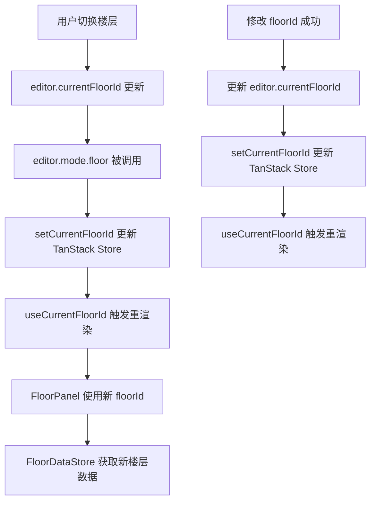

# Design Document: FloorPanel Migration

## Overview

将 FloorPanel 从原有的 DOM 操作方式迁移为使用 `src/components/Table` React 组件。迁移后，FloorPanel 将通过 React 状态管理数据，使用 Table 组件渲染表格。

本次迁移采用与 TowerPanel 相同的 **React Query + Store + Service** 架构：
1. **FloorDataService** - 底层 API，封装数据拉取和保存，通过 floorId 参数显式指定操作对象
2. **FloorDataStore** - 封装 React Query 的 query 和保存 mutation
3. **FloorPanel** - 使用 Table 组件渲染，调用 Store 保存

### 核心设计：显式 floorId 参数

与 TowerPanel 不同，FloorPanel 操作的是一系列楼层文件。为了控制副作用：
- FloorDataService 的所有函数都接受 `floorId` 参数
- 不依赖全局的 `editor.currentFloorId`
- FloorDataStore 的 query key 包含 floorId，确保不同楼层的数据独立缓存

### 特殊功能保留

FloorPanel 包含两个特殊功能：
1. **修改 floorId** - 重命名楼层，无需刷新页面
2. **修改地图大小** - 调整地图尺寸和偏移

## Architecture

### 目录结构

```
src/
├── services/
│   └── floor/
│       ├── index.ts              # 导出
│       └── floorDataService.ts   # FloorData 底层服务
├── stores/
│   └── FloorDataStore.ts         # FloorData Store
├── queryClient.ts                # 共享 QueryClient 实例（添加 FLOOR_QUERY_KEY）
└── Workbench/
    └── FloorPanel/
        └── index.tsx             # FloorPanel 组件
```

### 数据流

```mermaid
graph TD
    A[用户编辑] --> B[FloorPanel: onChange]
    B --> C[FloorDataStore.save]
    C --> D[FloorDataService.saveActions]
    D --> E[写入 floors/{floorId}.js]
    E --> F[保存成功]
    F --> G[refetchQueries 刷新数据]
    
    H[editor_mode.floor] --> I[queryClient.refetchQueries]
    I --> J[FloorDataStore refetch]
    
    K[修改 floorId] --> L[FloorDataService.saveFloorWithNewId]
    L --> M[写入新文件]
    M --> N[TowerDataService.saveActions 更新 floorIds]
    N --> O[更新内存状态]
    O --> P[refetchQueries 使用新 floorId]
```

## Components and Interfaces

### Query Key 定义 (src/queryClient.ts)

```typescript
/**
 * FloorPanel 数据的 Query Key
 * 包含 floorId 以区分不同楼层的缓存
 */
export const FLOOR_QUERY_KEY = (floorId: string) => ['floor-data', floorId] as const;
```

### FloorDataService (src/services/floor/floorDataService.ts)

```typescript
import type { Action } from '@/utils/action';
import type { CommentObject } from '@/components/Table';

export type { Action };

/**
 * 获取楼层属性数据
 * 
 * @param floorId - 楼层 ID
 * @param floorCommentObj - 楼层注释配置对象（用于过滤 loc 字段）
 * @returns 过滤后的楼层数据
 */
export function fetchFloorData(
  floorId: string,
  floorCommentObj: CommentObject
): Record<string, unknown> {
  // 从 core.floors 获取楼层数据
  const floorData = core.floors[floorId];
  if (!floorData) {
    throw new Error(`Floor ${floorId} not found`);
  }
  
  // 过滤数据：排除 map 相关字段和 loc 相关字段
  const result: Record<string, unknown> = {};
  const locFields = new Set(
    Object.keys(floorCommentObj._data?.loc?._data || {})
  );
  const mapFields = new Set(['map', 'bgmap', 'fgmap']);
  
  for (const key of Object.keys(floorData)) {
    if (!mapFields.has(key) && !locFields.has(key)) {
      result[key] = floorData[key];
    }
  }
  
  // 补充 commentObj 中定义但数据中不存在的字段为 null
  const floorFields = floorCommentObj._data?.floor?._data;
  if (floorFields && typeof floorFields === 'object') {
    for (const key of Object.keys(floorFields)) {
      if (!(key in result)) {
        result[key] = null;
      }
    }
  }
  
  return result;
}

/**
 * 保存楼层属性修改
 * 
 * @param floorId - 楼层 ID
 * @param actions - Action 列表
 */
export async function saveActions(
  floorId: string,
  actions: Action[]
): Promise<void> {
  if (actions.length === 0) return;
  
  // 应用 actions 到楼层数据
  const floorData = core.floors[floorId];
  applyActions(floorData, actions);
  
  // 序列化并写入文件
  await writeFloorFile(floorId, floorData);
}

/**
 * 使用新 floorId 保存楼层
 * 
 * @param oldFloorId - 原楼层 ID
 * @param newFloorId - 新楼层 ID
 */
export async function saveFloorWithNewId(
  oldFloorId: string,
  newFloorId: string
): Promise<void> {
  const floorData = core.floors[oldFloorId];
  floorData.floorId = newFloorId;
  
  // 写入新文件
  await writeFloorFile(newFloorId, floorData);
}

/**
 * 写入楼层文件
 */
async function writeFloorFile(
  floorId: string,
  floorData: Record<string, unknown>
): Promise<void> {
  const content = serializeFloorToJs(floorId, floorData);
  await fs.promises.writeFile(
    `project/floors/${floorId}.js`,
    encode64(content),
    'base64'
  );
}
```

### FloorDataStore (src/stores/FloorDataStore.ts)

```typescript
import { useQuery, useMutation, useQueryClient } from '@tanstack/react-query';
import { FLOOR_QUERY_KEY } from '@/queryClient';
import { fetchFloorData, saveActions, type Action } from '@/services/floor';
import { useFloorTableMeta } from '@/services/tableMeta';
import type { CommentObject } from '@/components/Table';

interface UseFloorDataStoreProps {
  floorId: string;
}

export function useFloorDataStore(props: UseFloorDataStoreProps) {
  const { floorId } = props;
  const queryClient = useQueryClient();

  // 获取 floor commentObj
  const metaQuery = useFloorTableMeta();
  const floorMeta = metaQuery.meta?._data?.floor as CommentObject | undefined;

  // Query: 获取楼层数据
  const dataQuery = useQuery({
    queryKey: FLOOR_QUERY_KEY(floorId),
    queryFn: () => {
      if (!floorMeta) throw new Error('Floor meta not loaded');
      return fetchFloorData(floorId, metaQuery.meta!);
    },
    enabled: !!floorMeta,
  });

  // Mutation: 保存修改
  const saveMutation = useMutation({
    mutationFn: (actions: Action[]) => saveActions(floorId, actions),
    onSuccess: () => {
      queryClient.refetchQueries({ queryKey: FLOOR_QUERY_KEY(floorId) });
      printf?.('保存成功！');
    },
    onError: (err) => {
      printe?.(String(err));
    },
  });

  return {
    data: dataQuery.data,
    commentObj: floorMeta,
    isLoading: dataQuery.isLoading || metaQuery.isLoading,
    error: dataQuery.error || metaQuery.error,
    save: (actions: Action[]) => saveMutation.mutateAsync(actions),
    isSaving: saveMutation.isPending,
  };
}
```

### FloorPanel 组件

FloorPanel 需要处理 `currentFloorId` 与全局状态的同步：

1. **初始化**：从 `editor.currentFloorId` 获取初始值
2. **外部切换楼层**：当用户在其他地方切换楼层时，需要同步更新
3. **修改 floorId**：修改成功后更新本地和全局状态

为了实现同步，我们使用 `@tanstack/store` 来管理编辑器全局状态：

#### EditorStore (src/stores/editorState.ts)

```typescript
/**
 * EditorStore - 编辑器全局状态
 * 
 * 使用 @tanstack/store 管理编辑器的全局状态，
 * 提供响应式的状态订阅机制。
 */

import { Store } from '@tanstack/store';

interface EditorState {
  currentFloorId: string;
}

/**
 * 编辑器状态 Store
 * 
 * 初始值从全局 editor.currentFloorId 获取
 */
export const editorStateStore = new Store<EditorState>({
  currentFloorId: typeof editor !== 'undefined' ? editor.currentFloorId : '',
});

/**
 * 更新当前楼层 ID
 */
export function setCurrentFloorId(floorId: string): void {
  editorStateStore.setState((state) => ({
    ...state,
    currentFloorId: floorId,
  }));
}
```

#### useCurrentFloorId Hook

```typescript
import { useStore } from '@tanstack/react-store';
import { editorStateStore } from '@/stores/editorState';

/**
 * 获取当前楼层 ID 的 Hook
 * 
 * 自动订阅状态变化，当 currentFloorId 变化时触发重渲染
 */
export function useCurrentFloorId(): string {
  return useStore(editorStateStore, (state) => state.currentFloorId);
}
```

#### 修改 editor_mode.prototype.floor

```typescript
import { setCurrentFloorId } from '@/stores/editorState';
import { queryClient, FLOOR_QUERY_KEY } from '@/queryClient';

editor_mode.prototype.floor = function (callback) {
    const floorId = editor.currentFloorId;
    
    // 更新 TanStack Store 状态
    setCurrentFloorId(floorId);
    
    // 刷新 React Query 缓存
    queryClient.refetchQueries({ queryKey: FLOOR_QUERY_KEY(floorId) });
    
    if (Boolean(callback)) callback();
}
```

#### FloorPanel 组件

```typescript
import { useState, useCallback, type FC } from 'react';
import { LeftTab } from '../components/LeftTab';
import { Table, EditModeSegmented } from '@/components/Table';
import { useTableMetaEditor } from '@/components/Table/hooks';
import { useFloorDataStore } from '@/stores/FloorDataStore';
import { saveFloorWithNewId } from '@/services/floor';
import { saveActions as saveTowerActions } from '@/services/tower';
import { queryClient, FLOOR_QUERY_KEY } from '@/queryClient';
import { useCurrentFloorId, setCurrentFloorId } from '@/stores/editorState';
import type { EditMode, TableAction } from '@/components/Table/types';

export const FloorPanel: FC = () => {
  // 使用 TanStack Store 获取当前楼层 ID
  const currentFloorId = useCurrentFloorId();
  
  // 从 Store 获取数据
  const { data, commentObj, isLoading, error, save } = useFloorDataStore({
    floorId: currentFloorId,
  });

  // 编辑模式
  const [editMode, setEditMode] = useState<EditMode>('change');
  
  // 修改 floorId 相关状态
  const [floorIdValue, setFloorIdValue] = useState('');
  
  // 修改地图大小相关状态
  const [newWidth, setNewWidth] = useState('13');
  const [newHeight, setNewHeight] = useState('13');
  const [offsetX, setOffsetX] = useState('0');
  const [offsetY, setOffsetY] = useState('0');

  // 使用 useTableMetaEditor 获取编辑器打开函数
  const { openEditor } = useTableMetaEditor('comment');

  // 统一的变更处理 - 即时保存
  const handleChange = useCallback(
    async (action: TableAction) => {
      await save([action]);
    },
    [save],
  );

  // 修改 floorId
  const handleChangeFloorId = useCallback(async () => {
    const newFloorId = floorIdValue.trim();
    if (!newFloorId) {
      printe('请输入要修改到的 floorId');
      return;
    }
    
    // 验证格式
    if (!/^[a-zA-Z_][a-zA-Z0-9_]*$/.test(newFloorId)) {
      printe(`楼层名 ${newFloorId} 不合法！请使用字母、数字、下划线，且不能以数字开头！`);
      return;
    }
    
    // 检查是否已存在
    if (main.floorIds.includes(newFloorId)) {
      printe(`楼层名 ${newFloorId} 已存在！`);
      return;
    }
    
    try {
      // 1. 保存新文件
      await saveFloorWithNewId(currentFloorId, newFloorId);
      
      // 2. 更新全塔属性中的 floorIds
      const newFloorIds = [...core.floorIds];
      const index = newFloorIds.indexOf(currentFloorId);
      if (index >= 0) {
        newFloorIds[index] = newFloorId;
      }
      await saveTowerActions([
        ['change', "['main']['floorIds']", newFloorIds],
      ]);
      
      // 3. 更新内存状态（全局状态）
      core.floorIds[index] = newFloorId;
      editor.currentFloorId = newFloorId;
      editor.currentFloorData.floorId = newFloorId;
      
      // 4. 更新 TanStack Store 状态
      setCurrentFloorId(newFloorId);
      
      // 5. 刷新 React Query 缓存
      queryClient.invalidateQueries({ queryKey: FLOOR_QUERY_KEY(newFloorId) });
      
      printf('修改 floorId 成功！');
      setFloorIdValue('');
    } catch (err) {
      printe(String(err));
    }
  }, [currentFloorId, floorIdValue]);

  // 修改地图大小（保留原有逻辑，但使用 service）
  const handleChangeFloorSize = useCallback(async () => {
    // ... 原有的验证和处理逻辑
  }, [currentFloorId, newWidth, newHeight, offsetX, offsetY]);

  // 操作按钮区域
  const actions = (
    <>
      <EditModeSegmented value={editMode} onChange={setEditMode} />
      &nbsp;&nbsp;
      <button onClick={() => openEditor()}>配置表格</button>
    </>
  );

  return (
    <LeftTab
      id="left4"
      title="楼层属性"
      actions={actions}
      loading={isLoading && !data}
      error={error ? String(error) : null}
    >
      {data && commentObj && (
        <Table
          data={data}
          commentObj={commentObj}
          onChange={handleChange}
          editMode={editMode}
        />
      )}
      
      {/* 修改 floorId */}
      <div id="changeFloorId">
        <input
          value={floorIdValue}
          onChange={(e) => setFloorIdValue(e.target.value)}
          placeholder="修改 floorId 为"
        />
        <button onClick={handleChangeFloorId}>确定</button>
      </div>
      
      {/* 修改地图大小 */}
      <div id="changeFloorSize" style={{ fontSize: 13 }}>
        修改地图大小：宽
        <input style={{ width: 25 }} value={newWidth} onChange={(e) => setNewWidth(e.target.value)} />
        ，高
        <input style={{ width: 25 }} value={newHeight} onChange={(e) => setNewHeight(e.target.value)} />
        ，偏移 x
        <input style={{ width: 25 }} value={offsetX} onChange={(e) => setOffsetX(e.target.value)} />
        y
        <input style={{ width: 25 }} value={offsetY} onChange={(e) => setOffsetY(e.target.value)} />
        <button onClick={handleChangeFloorSize}>确定</button>
      </div>
    </LeftTab>
  );
};
```

### currentFloorId 同步机制



### TanStack Store 的优势

1. **与 TanStack Query 一致**：使用相同的技术栈，API 风格一致
2. **自动订阅管理**：`useStore` hook 自动处理订阅和取消订阅
3. **细粒度更新**：只有依赖的状态变化时才触发重渲染
4. **类型安全**：完整的 TypeScript 支持
5. **轻量级**：体积小，无额外依赖

### editor_mode.prototype.floor 修改

```typescript
import { queryClient, FLOOR_QUERY_KEY } from '@/queryClient';

editor_mode.prototype.floor = function (callback) {
    // 使用 React Query 刷新 FloorPanel 数据
    const floorId = editor.currentFloorId;
    queryClient.refetchQueries({ queryKey: FLOOR_QUERY_KEY(floorId) });
    if (Boolean(callback)) callback();
}
```

## Data Models

### Action 类型

复用 `src/utils/action.ts` 中的 Action 类型：

```typescript
export type Action = ['change' | 'add' | 'delete', string, unknown];
```

### 楼层数据结构

楼层数据存储在 `core.floors[floorId]` 中，包含：
- 基本属性：`floorId`, `title`, `name`, `width`, `height` 等
- 地图数据：`map`, `bgmap`, `fgmap`（在 FloorPanel 中过滤掉）
- 事件数据：`events`, `beforeBattle`, `afterBattle` 等（loc 相关，在 FloorPanel 中过滤掉）

FloorDataService 返回的数据只包含基本属性，不包含地图和事件数据。


## Correctness Properties

*A property is a characteristic or behavior that should hold true across all valid executions of a system—essentially, a formal statement about what the system should do. Properties serve as the bridge between human-readable specifications and machine-verifiable correctness guarantees.*

### Property 1: Data Filtering

*For any* floor data object and commentObj, `fetchFloorData` SHALL return a data object that:
- Does NOT contain map-related fields (`map`, `bgmap`, `fgmap`)
- Does NOT contain loc-related fields (as defined in `commentObj._data.floors._data.loc._data`)
- Contains all floor-related fields (as defined in `commentObj._data.floors._data.floor._data`), with missing fields set to `null`

**Validates: Requirements 3.5, 3.6**

### Property 2: FloorId Parameter Isolation

*For any* two different floorIds `A` and `B`:
- `fetchFloorData(A, commentObj)` SHALL return data from `core.floors[A]`
- `fetchFloorData(B, commentObj)` SHALL return data from `core.floors[B]`
- `saveActions(A, actions)` SHALL write to `project/floors/A.js`
- `saveActions(B, actions)` SHALL write to `project/floors/B.js`

**Validates: Requirements 3.1, 3.2, 3.3, 3.4, 4.2, 4.5**

### Property 3: FloorId Validation

*For any* input string as new floorId:
- IF the string does NOT match `/^[a-zA-Z_][a-zA-Z0-9_]*$/`, THEN validation SHALL fail
- IF the string already exists in `main.floorIds`, THEN validation SHALL fail
- IF validation fails, THEN an error message SHALL be displayed and no save operation SHALL occur

**Validates: Requirements 6.1, 6.2, 6.3**

### Property 4: Dimension Validation

*For any* input dimensions (width, height, offsetX, offsetY):
- IF width > 128 OR height > 128, THEN validation SHALL fail
- IF offsetX < 0 OR offsetY < 0, THEN validation SHALL fail
- IF validation fails, THEN an error message SHALL be displayed and no resize operation SHALL occur

**Validates: Requirements 7.1, 7.2, 7.3**

### Property 5: Coordinate Transformation

*For any* floor resize operation with offset (x, y) and new dimensions (newWidth, newHeight):
- *For any* coordinate-based field (events, beforeBattle, afterBattle, afterGetItem, afterOpenDoor, changeFloor, autoEvent, cannotMove):
  - *For any* original coordinate `(ox, oy)` with value `v`:
    - The new coordinate SHALL be `(ox + x, oy + y)`
    - IF new coordinate is within bounds `[0, newWidth) × [0, newHeight)`, THEN the value SHALL be preserved
    - IF new coordinate is out of bounds, THEN the entry SHALL be removed
- *For any* upFloor/downFloor coordinate `[ox, oy]`:
  - The new coordinate SHALL be `[ox + x, oy + y]`

**Validates: Requirements 7.4, 7.5, 7.6**

## Error Handling

1. **数据加载失败**: React Query 设置 `error` 状态，FloorPanel 显示错误信息
2. **保存失败**: 使用 `printe()` 显示错误信息
3. **floorId 验证失败**: 使用 `printe()` 显示具体的验证错误
4. **地图大小验证失败**: 使用 `printe()` 显示参数错误信息
5. **楼层不存在**: `fetchFloorData` 抛出错误，由调用方处理

## Testing Strategy

### 单元测试

1. **FloorDataService 测试**
   - `fetchFloorData`: 验证数据过滤逻辑（Property 1）
   - `saveActions`: 验证 action 应用和文件写入
   - `saveFloorWithNewId`: 验证新文件创建

2. **验证函数测试**
   - floorId 格式验证（Property 3）
   - 地图大小参数验证（Property 4）

3. **坐标转换测试**
   - 验证坐标偏移计算（Property 5）
   - 验证边界处理

### 属性测试

1. **Property 1: Data Filtering**
   - 生成随机的 floor data 和 commentObj
   - 验证返回数据不包含 map 和 loc 字段
   - 验证返回数据包含所有 floor 字段

2. **Property 2: FloorId Parameter Isolation**
   - 生成随机的 floorId 对
   - 验证读写操作使用正确的 floorId

3. **Property 3: FloorId Validation**
   - 生成随机的 floorId 字符串
   - 验证格式验证和重复检测

4. **Property 4: Dimension Validation**
   - 生成随机的维度参数
   - 验证边界检查

5. **Property 5: Coordinate Transformation**
   - 生成随机的坐标数据和偏移量
   - 验证坐标转换正确性

### 测试框架

- 使用 Vitest 作为测试框架
- 使用 fast-check 进行属性测试
- 每个属性测试运行至少 100 次迭代

