# Design Document: Tower Comment Sync

## Overview

本设计解决 TowerPanel 中 commentObj 数据同步问题。核心思路是让 `TowerDataStore` 内部使用 `useTowerTableMeta` 获取 commentObj，完全移除对 `editor.file.dataComment` 的依赖。通过 React Query 的缓存机制实现数据联动。

## Architecture

```mermaid
graph TB
    subgraph "当前架构（问题）"
        TowerPanel1[TowerPanel]
        TowerDataStore1[TowerDataStore]
        readTowerData1[readTowerData]
        getCommentObject1[getCommentObject]
        editorFile1[editor.file.dataComment]
        
        TowerPanel1 --> TowerDataStore1
        TowerDataStore1 --> readTowerData1
        readTowerData1 --> getCommentObject1
        getCommentObject1 --> editorFile1
    end
    
    subgraph "目标架构"
        TowerPanel2[TowerPanel]
        TowerDataStore2[TowerDataStore]
        useTowerTableMeta[useTowerTableMeta]
        useTableMetaFile[useTableMetaFile]
        ReactQueryCache[React Query Cache]
        readTowerData2[readTowerData]
        
        TowerPanel2 --> TowerDataStore2
        TowerDataStore2 --> useTowerTableMeta
        TowerDataStore2 --> readTowerData2
        useTowerTableMeta --> useTableMetaFile
        useTableMetaFile --> ReactQueryCache
    end
```



### 方案选择

**选择方案 B：TowerDataStore 内部集成 useTowerTableMeta**

原因：
1. `readTowerData` 内部依赖 `getCommentObject()` 获取 `mainCommentData` 用于 null 填充逻辑
2. 完全移除 `getCommentObject` 函数，统一数据来源
3. 对外 API 保持不变，TowerPanel 代码无需修改
4. 数据一致性更好，避免两个数据源不同步的问题

## Components and Interfaces

### 1. TowerDataStore 重构

将数据处理逻辑移到 `TowerDataStore` 中，`readTowerData` 只返回原始数据：

```typescript
// src/stores/TowerDataStore.ts

import { createStore } from '@/utils/store/store';
import { useQuery, useMutation, useQueryClient } from '@tanstack/react-query';
import { TOWER_QUERY_KEY } from '@/queryClient';
import { fetchTowerData, saveActions, type Action } from '@/services/tower';
import { useTowerTableMeta } from '@/services/tableMeta';
import type { CommentObject } from '@/components/Table';

/**
 * 处理 main 字段的 null 填充
 * 根据 commentObj 中定义的字段，对 data.main 进行处理
 */
function processMainFields(
  data: Record<string, unknown>,
  commentObj: CommentObject
): Record<string, unknown> {
  const result = { ...data, main: {} };
  
  const mainCommentData = (commentObj as any)?._data?.main?._data;
  const editorMain = (editor as any)?.main as Record<string, unknown> | undefined;
  const dataMain = data.main as Record<string, unknown> | undefined;

  if (mainCommentData && typeof mainCommentData === 'object') {
    const mainData: Record<string, unknown> = {};

    for (const key of Object.keys(mainCommentData)) {
      if (editorMain && key in editorMain) {
        mainData[key] = dataMain?.[key];
      } else {
        mainData[key] = null;
      }
    }

    result.main = mainData;
  }

  return result;
}

const useTowerDataStore = () => {
  const queryClient = useQueryClient();
  
  // 从 useTowerTableMeta 获取 commentObj
  const metaQuery = useTowerTableMeta();

  // Query: 获取原始 data
  const dataQuery = useQuery({
    queryKey: TOWER_QUERY_KEY,
    queryFn: fetchTowerData,
  });

  // 合并 data 和 commentObj，处理 main 字段
  const towerData = dataQuery.data && metaQuery.meta ? {
    data: processMainFields(dataQuery.data, metaQuery.meta),
    commentObj: metaQuery.meta,
  } : undefined;

  // Mutation: 批量保存
  const saveMutation = useMutation({
    mutationFn: (actionList: Action[]) => saveActions(actionList),
    onSuccess: () => {
      queryClient.refetchQueries({ queryKey: TOWER_QUERY_KEY });
      printf?.('保存成功！');
    },
    onError: (err) => {
      printe?.(String(err));
    },
  });

  return {
    towerData,
    isLoading: dataQuery.isLoading || metaQuery.isLoading,
    error: dataQuery.error || metaQuery.error,
    save: (actionList: Action[]) => saveMutation.mutateAsync(actionList),
    isSaving: saveMutation.isPending,
  };
};

export const TowerDataStore = createStore(useTowerDataStore);
```

### 2. towerDataService 简化

移除 `getCommentObject` 和 `readTowerData` 函数，简化服务层：

```typescript
// src/services/tower/towerDataService.ts

import { applyActions, type Action } from '@/utils/action';
import { encode64 } from '@/utils/encoding';
import { serializeToJsFile, alertWhenCompress } from '@/utils/serialize';
import { createWriteExecutor } from '@/utils/writeExecutor';
import { fs } from '@/services/fs';

export type { Action };

/** 数据变量名 */
const DATA_VAR_NAME = 'data_a1e2fb4a_e986_4524_b0da_9b7ba7c0874d';

/** 数据文件路径 */
const DATA_FILE_PATH = 'project/data.js';

/** 写入执行器实例 */
const writeExecutor = createWriteExecutor();

/**
 * 获取全局数据对象
 */
function getDataObject(): Record<string, unknown> {
  return (window as any)[DATA_VAR_NAME] as Record<string, unknown>;
}

/**
 * 写入全塔属性数据
 */
export async function writeTowerData(actions: Action[]): Promise<void> {
  if (actions.length === 0) {
    return;
  }

  const dataObj = getDataObject();

  // 立即应用所有 actions 到数据对象
  applyActions(dataObj, actions);

  // 检查 firstData.floorId 是否在 main.floorIds 中
  const mainFloorIds = (dataObj.main as Record<string, unknown>)?.floorIds as string[] | undefined;
  const firstData = dataObj.firstData as Record<string, unknown> | undefined;
  if (mainFloorIds && firstData && Array.isArray(mainFloorIds)) {
    if (!mainFloorIds.includes(firstData.floorId as string)) {
      firstData.floorId = mainFloorIds[0];
    }
  }

  alertWhenCompress();

  await writeExecutor.exec(async () => {
    const content = serializeToJsFile(DATA_VAR_NAME, getDataObject());
    await fs.promises.writeFile(DATA_FILE_PATH, encode64(content), 'base64');
  });
}

/**
 * 获取全塔属性数据
 */
export function fetchTowerData(): Promise<Record<string, unknown>> {
  return Promise.resolve(getDataObject());
}

/**
 * 批量保存修改（兼容旧 API）
 */
export function saveActions(actionList: Action[]): Promise<void> {
  return writeTowerData(actionList);
}
```

### 3. TowerPanel 保持不变

由于 TowerDataStore 的 API 保持不变，TowerPanel 无需修改：

```typescript
// src/Workbench/TowerPanel/index.tsx - 无需修改

export const TowerPanel: FC = () => {
  const { towerData, isLoading, error, save } = TowerDataStore.useStore();
  const { openEditor } = useTableMetaEditor('dataComment');
  
  // ... 其余代码保持不变
  
  return (
    <LeftTab ...>
      {towerData && (
        <Table
          data={towerData.data}
          commentObj={towerData.commentObj}
          onChange={handleChange}
          editMode={editMode}
        />
      )}
    </LeftTab>
  );
};
```

### 4. useTowerTableMeta 确认

确认 `useTowerTableMeta` 已正确实现：

```typescript
// src/services/tableMeta/hooks/useTowerTableMeta.ts

export function useTowerTableMeta(): UseTowerTableMetaResult {
  const { content, fileKey, save, isLoading, isSaving, error, promise } = useTableMetaFile('dataComment');

  const meta = useMemo<CommentObject | undefined>(() => {
    if (!content) return undefined;
    try {
      return parseTableMetaJs(content, META_FILE_CONFIG.dataComment.varName);
    } catch {
      return undefined;
    }
  }, [content]);

  return {
    meta,
    fileKey,
    save,
    promise,
    isLoading,
    isSaving,
    error,
  };
}
```

## Data Models

### TowerDataWithComment（Store 层返回类型）

```typescript
/** 全塔属性数据结构（Store 层，含 commentObj） */
export interface TowerDataWithComment {
  /** 数据对象（已处理 main 字段） */
  data: Record<string, unknown>;
  /** 注释配置对象 */
  commentObj: CommentObject;
}
```

### UseTowerTableMetaResult

```typescript
export interface UseTowerTableMetaResult {
  /** 解析后的元数据对象 */
  meta: CommentObject | undefined;
  /** 文件 key */
  fileKey: 'dataComment';
  /** 保存文件内容 */
  save: (content: string) => Promise<void>;
  /** 等待内容加载完成的 Promise */
  promise: Promise<string>;
  /** 是否正在加载 */
  isLoading: boolean;
  /** 是否正在保存 */
  isSaving: boolean;
  /** 加载错误 */
  error: Error | null;
}
```

## Correctness Properties

*A property is a characteristic or behavior that should hold true across all valid executions of a system-essentially, a formal statement about what the system should do. Properties serve as the bridge between human-readable specifications and machine-verifiable correctness guarantees.*

基于 prework 分析，以下是需要验证的正确性属性：

### Property 1: 缓存联动

*For any* 对 `useTableMetaFile('dataComment')` 缓存的更新，`TowerDataStore` 返回的 `towerData.commentObj` 应该反映该更新。

**Validates: Requirements 1.1, 3.2**

### Property 2: 保存后缓存更新

*For any* 成功的 `saveTableMetaFile('dataComment', content)` 调用，后续的 `TowerDataStore` 应该返回基于新 content 解析的 commentObj。

**Validates: Requirements 1.3, 3.1**

### Property 3: API 兼容性

*For any* 对 `TowerDataStore.useStore()` 的调用，返回值应包含 `towerData`（含 `data` 和 `commentObj`）、`isLoading`、`error`、`save` 和 `isSaving` 字段。

**Validates: Requirements 2.3**

## Error Handling

### 加载错误

- 当 `useTableMetaFile` 加载失败时，`useTowerTableMeta` 返回 `error` 对象
- TowerPanel 应显示错误信息而非崩溃

### 解析错误

- 当 `parseTableMetaJs` 解析失败时，`meta` 返回 `undefined`
- TowerPanel 应处理 `commentObj` 为 `undefined` 的情况

### 保存错误

- 当 `saveTableMetaFile` 失败时，mutation 的 `onError` 回调会调用 `printe` 显示错误
- 缓存不会被更新，保持原有数据

## Testing Strategy

### 单元测试

1. **TowerDataStore 测试**
   - 测试 towerData 正确合并 data 和 commentObj
   - 测试加载状态的合并
   - 测试错误状态的处理

2. **towerDataService 测试**
   - 测试 readTowerData 接收 commentObj 参数
   - 测试 main 字段的 null 填充逻辑

### Property-Based Tests

使用 fast-check 进行属性测试，每个属性测试至少运行 100 次迭代。

由于这些属性涉及 React Query 的缓存机制，属性测试需要在集成测试环境中进行，或者通过 mock React Query 来验证。

测试标签格式：**Feature: tower-comment-sync, Property {number}: {property_text}**
