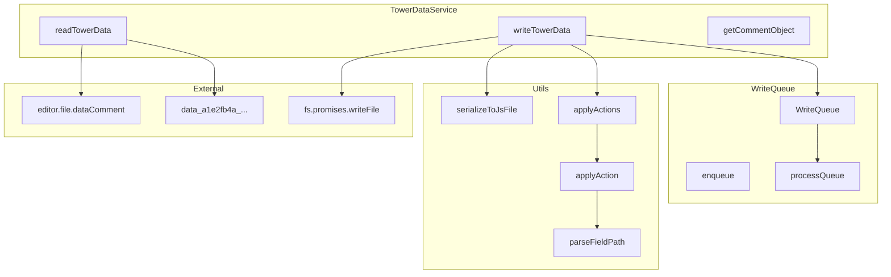

# Design Document

## Overview

本设计将 `editor.file.editTower` 函数重构为独立的服务模块，实现读写分离、竞态处理和可复用的工具函数。设计遵循单一职责原则，将数据读取、数据写入、Action 应用和序列化分离为独立的函数。

## Architecture



## Components and Interfaces

### 1. 字段路径工具函数 (复用自 src/utils/fieldPath.ts)

将 `src/components/Table/utils/fieldPath.ts` 中的路径处理函数移动到 `src/utils/fieldPath.ts` 以便更大范围复用。

```typescript
// 从 src/utils/fieldPath.ts 导入
import { parseFieldPath, buildFieldPath, getByFieldPath } from '@/utils/fieldPath';
```

需要新增的函数：

```typescript
/**
 * 根据 field path 设置对象中的值
 * 如果中间路径不存在，自动创建空对象
 * 
 * @param obj - 目标对象
 * @param fieldPath - 字段路径，如 "['main']['floorIds']"
 * @param value - 要设置的值
 */
function setByFieldPath(obj: Record<string, unknown>, fieldPath: string, value: unknown): void;

/**
 * 根据 field path 删除对象中的字段
 * 
 * @param obj - 目标对象
 * @param fieldPath - 字段路径，如 "['main']['floorIds']"
 * @returns 是否成功删除
 */
function deleteByFieldPath(obj: Record<string, unknown>, fieldPath: string): boolean;
```

### 2. Action 应用函数 (applyAction / applyActions)

将 Action 应用到目标对象上，支持 `change`、`add`、`delete` 操作。

```typescript
type ActionType = 'change' | 'add' | 'delete';
type Action = [ActionType, string, unknown];

/**
 * 应用单个 Action 到目标对象
 * @param target 目标对象
 * @param action Action 元组 [type, path, value]
 */
function applyAction(target: Record<string, unknown>, action: Action): void;

/**
 * 批量应用 Actions 到目标对象
 * @param target 目标对象
 * @param actions Action 列表
 */
function applyActions(target: Record<string, unknown>, actions: Action[]): void;
```

### 3. 序列化函数 (serializeToJsFile)

将数据对象序列化为 JS 文件格式的字符串。

```typescript
/**
 * 将数据序列化为 JS 文件格式
 * @param varName 变量名
 * @param data 数据对象
 * @returns JS 文件内容字符串
 */
function serializeToJsFile(varName: string, data: unknown): string;
```

### 3.1 压缩提醒函数 (alertWhenCompress)

检查是否使用压缩文件，首次检测到时提醒用户。

```typescript
/**
 * 检查并提醒用户关于压缩文件的使用
 * 如果 editor.useCompress 为 true，显示提醒并将其设为 'alerted'
 */
function alertWhenCompress(): void;
```

### 4. 写入同步管理

管理并发写入操作，使用工厂函数创建独立的执行器实例。每个数据服务（如 towerData、itemData、enemyData）可以拥有独立的写入执行器，避免不同文件的写入操作相互阻塞。

```typescript
interface WriteExecutor {
  /** 当前是否正在写入 */
  readonly isWriting: boolean;
  /** 执行写入操作，处理并发情况 */
  exec(writeTask: () => Promise<void>): Promise<void>;
}

/**
 * 创建写入执行器
 * 内部维护 isWriting 和 needsRewrite 标志位
 * @returns WriteExecutor 实例
 */
function createWriteExecutor(): WriteExecutor;
```

使用示例：

```typescript
// 每个数据服务创建自己的执行器
const towerWriteExecutor = createWriteExecutor();
const itemWriteExecutor = createWriteExecutor();

// 使用执行器进行写入
await towerWriteExecutor.exec(async () => {
  await fs.promises.writeFile(path, content);
});
```

### 5. 数据读取函数 (readTowerData)

读取全塔属性数据，合并 data 对象和 main 字段。只对 `main` 子对象中的字段进行 null 填充。

```typescript
interface TowerData {
  data: Record<string, unknown>;
  commentObj: CommentObject;
}

/**
 * 读取全塔属性数据
 * @returns 包含数据对象和注释配置
 */
function readTowerData(): TowerData;
```

### 6. 数据写入函数 (writeTowerData)

将 Action 列表应用到数据对象并写入文件。写入前调用 `alertWhenCompress` 提醒用户。

```typescript
/**
 * 写入全塔属性数据
 * @param actions Action 列表
 * @returns Promise，写入完成时 resolve
 */
function writeTowerData(actions: Action[]): Promise<void>;
```

### 7. 注释对象获取函数 (getCommentObject)

获取全塔属性的注释配置对象。

```typescript
/**
 * 获取注释配置对象
 * @returns 注释配置对象
 */
function getCommentObject(): CommentObject;
```

## Data Models

### Action 类型

```typescript
/** 操作类型 */
type ActionType = 'change' | 'add' | 'delete';

/** Action 元组：[操作类型, 字段路径, 值] */
type Action = [ActionType, string, unknown];
```

### TowerData 类型

```typescript
/** 全塔属性数据结构 */
interface TowerData {
  /** 数据对象，包含 firstData、values、main 等字段 */
  data: Record<string, unknown>;
  /** 注释配置对象 */
  commentObj: CommentObject;
}
```

### WriteExecutor 类型

```typescript
/** 写入执行器接口 */
interface WriteExecutor {
  /** 当前是否正在写入 */
  readonly isWriting: boolean;
  /** 执行写入操作，处理并发情况 */
  exec(writeTask: () => Promise<void>): Promise<void>;
}
```


## Correctness Properties

*A property is a characteristic or behavior that should hold true across all valid executions of a system-essentially, a formal statement about what the system should do. Properties serve as the bridge between human-readable specifications and machine-verifiable correctness guarantees.*

### Property 1: change/add 操作设置值

*For any* action 类型为 `change` 或 `add`，应用该 action 后，目标对象在指定路径的值应等于 action 中的值。

**Validates: Requirements 5.2**

### Property 2: delete 操作删除字段

*For any* action 类型为 `delete` 或值为 `undefined`，应用该 action 后，目标对象在指定路径的字段应不存在。

**Validates: Requirements 2.3, 5.3**

### Property 3: 嵌套路径支持

*For any* 嵌套字段路径（如 `['a']['b']['c']`），`setByFieldPath` 和 `deleteByFieldPath` 应能正确解析并操作该路径，无论嵌套深度如何。

**Validates: Requirements 5.4**

### Property 4: 序列化输出有效性

*For any* 有效的数据对象，`serializeToJsFile` 的输出应是可被 JavaScript 引擎解析的有效代码，且解析后的值应与原始数据等价。

**Validates: Requirements 6.4**

## Error Handling

### 字段路径解析错误

- 当字段路径格式不正确时，`parseFieldPath` 应抛出描述性错误
- 空路径应返回空数组

### Action 应用错误

- 当目标路径的父级不存在时，`applyAction` 应自动创建中间对象
- 当尝试在非对象上设置属性时，应抛出错误

### 写入错误

- 文件系统写入失败时，`writeTowerData` 应 reject Promise 并传递错误信息
- 写入队列中的任务失败不应影响后续任务的执行

### 数据读取错误

- 当 `editor.file.dataComment` 不可用时，应抛出描述性错误

## Testing Strategy

### 单元测试

使用 Vitest 进行单元测试，覆盖以下场景：

1. **fieldPath 工具函数**
   - 测试 `setByFieldPath` 设置嵌套值
   - 测试 `deleteByFieldPath` 删除嵌套字段
   - 测试自动创建中间对象

2. **applyAction**
   - change 操作设置值
   - add 操作添加新字段
   - delete 操作删除字段
   - 嵌套路径操作

3. **serializeToJsFile**
   - 正确的变量声明格式
   - tab 缩进格式
   - 特殊字符处理

4. **写入同步管理**
   - 单次写入执行
   - 并发写入时的 flag 机制
   - 写入失败后的处理

5. **readTowerData / writeTowerData**
   - 数据读取和 main 字段合并
   - 数据写入和序列化
   - alertWhenCompress 调用

### 属性测试

使用 fast-check 进行属性测试，每个属性测试至少运行 100 次迭代。

测试标签格式：**Feature: tower-data-refactor, Property {number}: {property_text}**

1. **Property 1**: 生成随机 change/add action，验证值被正确设置
2. **Property 2**: 生成随机 delete action，验证字段被删除
3. **Property 3**: 生成随机深度的嵌套路径，验证正确处理
4. **Property 4**: 生成随机数据对象，验证序列化后可解析且等价
