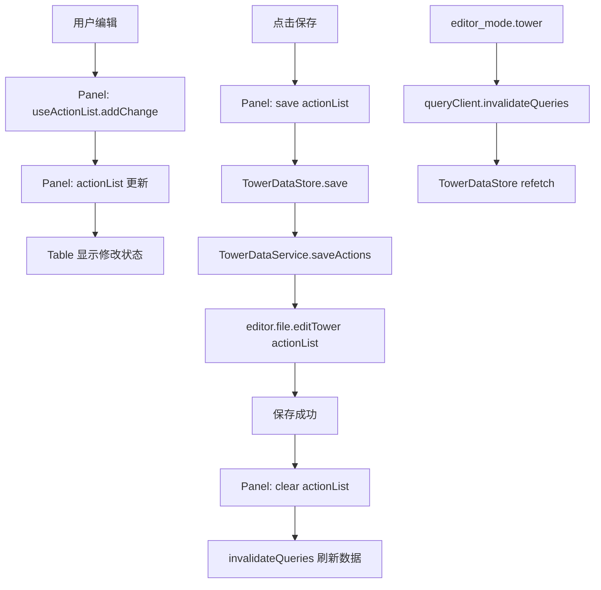

# Design Document: TowerPanel Migration

## Overview

将 TowerPanel 从原有的 DOM 操作方式迁移为使用 `src/components/Table` React 组件。迁移后，TowerPanel 将通过 React 状态管理数据，使用 Table 组件渲染表格。

本次迁移采用 **React Query + Store + ActionList** 组合架构：
1. **TowerDataService** - 底层 API，封装数据拉取和保存
2. **TowerDataStore** - 封装 React Query 的 query 和保存 mutation（纯数据层）
3. **useActionList** - 公共 Hook，管理修改列表（在 Panel 层使用，可复用于其他表格）
4. **TowerPanel** - 使用 Table 组件渲染，管理自己的 actionList，调用 Store 保存

### 核心设计：保持批量保存体验

与原有系统一致：
- 用户修改时，变更添加到 `actionList`
- 点击"保存"按钮时，统一提交所有变更
- 保存成功后清空 `actionList` 并刷新数据

## Architecture

### 目录结构

```
src/
├── hooks/
│   └── useActionList.ts          # 公共 Hook：修改列表管理
├── services/
│   └── tower/
│       ├── index.ts              # 导出
│       └── towerDataService.ts   # TowerData 底层服务
├── stores/
│   └── TowerDataStore.ts         # TowerData Store
├── queryClient.ts                # 共享 QueryClient 实例
└── Workbench/
    └── TowerPanel/
        └── index.tsx             # TowerPanel 组件
```

### 数据流



## Components and Interfaces

### 共享 QueryClient (src/queryClient.ts)

```typescript
import { QueryClient } from '@tanstack/react-query';

export const queryClient = new QueryClient();

export const TOWER_QUERY_KEY = ['tower-data'] as const;
```

### useActionList Hook (src/hooks/useActionList.ts)

公共 Hook，可复用于所有需要批量保存的表格面板。

```typescript
import { useState, useCallback } from 'react';

export type Action = ['change' | 'add' | 'delete', string, unknown];

export interface UseActionListReturn {
  /** 当前的修改列表 */
  actionList: Action[];
  /** 是否有未保存的修改 */
  hasChanges: boolean;
  /** 添加变更动作 */
  addChange: (field: string, value: unknown) => void;
  /** 添加新增动作 */
  addAdd: (field: string, id: string) => void;
  /** 添加删除动作 */
  addDelete: (field: string) => void;
  /** 清空修改列表 */
  clear: () => void;
}

export function useActionList(): UseActionListReturn {
  const [actionList, setActionList] = useState<Action[]>([]);

  const addChange = useCallback((field: string, value: unknown) => {
    setActionList(prev => [...prev, ['change', field, value]]);
  }, []);

  const addAdd = useCallback((field: string, id: string) => {
    const newField = field + "['" + id + "']";
    setActionList(prev => [...prev, ['add', newField, null]]);
  }, []);

  const addDelete = useCallback((field: string) => {
    setActionList(prev => [...prev, ['delete', field, undefined]]);
  }, []);

  const clear = useCallback(() => {
    setActionList([]);
  }, []);

  return {
    actionList,
    hasChanges: actionList.length > 0,
    addChange,
    addAdd,
    addDelete,
    clear,
  };
}
```

### TowerDataService (src/services/tower/towerDataService.ts)

```typescript
import type { CommentObject } from '@/components/Table';
import type { Action } from '@/hooks/useActionList';

export interface TowerData {
  data: Record<string, unknown>;
  commentObj: CommentObject;
}

/** 获取全塔属性数据 */
export function fetchTowerData(): Promise<TowerData> {
  return new Promise((resolve, reject) => {
    editor?.file?.editTower?.([], (objs) => {
      const [data, commentObj, error] = objs;
      if (error) {
        reject(error);
        return;
      }
      resolve({ data, commentObj });
    });
  });
}

/** 批量保存修改 */
export function saveActions(actionList: Action[]): Promise<void> {
  return new Promise((resolve, reject) => {
    if (actionList.length === 0) {
      resolve();
      return;
    }
    editor?.file?.editTower?.(actionList, (objs) => {
      const error = objs.slice(-1)[0];
      if (error) {
        reject(error);
      } else {
        resolve();
      }
    });
  });
}
```

### TowerDataStore (src/stores/TowerDataStore.ts)

Store 只负责数据获取和保存，不管理 actionList。actionList 由 Panel 层管理。

```typescript
import { createStore } from '@/utils/store/store';
import { useQuery, useMutation, useQueryClient } from '@tanstack/react-query';
import { TOWER_QUERY_KEY } from '@/queryClient';
import { fetchTowerData, saveActions } from '@/services/tower';
import type { Action } from '@/hooks/useActionList';

const useTowerDataStore = () => {
  const queryClient = useQueryClient();

  // Query: 获取数据
  const {
    data: towerData,
    isLoading,
    error,
  } = useQuery({
    queryKey: TOWER_QUERY_KEY,
    queryFn: fetchTowerData,
  });

  // Mutation: 批量保存（接收外部传入的 actionList）
  const saveMutation = useMutation({
    mutationFn: (actionList: Action[]) => saveActions(actionList),
    onSuccess: () => {
      queryClient.invalidateQueries({ queryKey: TOWER_QUERY_KEY });
      printf?.('保存成功！');
    },
    onError: (error) => {
      printe?.(String(error));
    },
  });

  return {
    // 数据
    towerData,
    isLoading,
    error,
    // 保存（由调用方传入 actionList）
    save: (actionList: Action[]) => saveMutation.mutateAsync(actionList),
    isSaving: saveMutation.isPending,
  };
};

export const TowerDataStore = createStore(useTowerDataStore);
```

### TowerPanel 组件

Panel 层使用 useActionList 管理自己的修改列表，保存时传给 Store。

```typescript
import type { FC } from 'react';
import {
  Table,
  createEditClickHandler,
  createDoubleClickHandler,
} from '@/components/Table';
import { TowerDataStore } from '@/stores/TowerDataStore';
import { useActionList } from '@/hooks/useActionList';

export const TowerPanel: FC = () => {
  // 从 Store 获取数据和保存方法
  const {
    towerData,
    isLoading,
    error,
    save,
    isSaving,
  } = TowerDataStore.useStore();

  // Panel 层管理自己的 actionList
  const {
    actionList,
    hasChanges,
    addChange,
    addAdd,
    addDelete,
    clear,
  } = useActionList();

  const handleEditClick = createEditClickHandler({
    setValue: (field, value) => addChange(field, value),
  });

  const handleDoubleClick = createDoubleClickHandler({
    setValue: (field, value) => addChange(field, value),
    onAdd: (field) => {
      const id = prompt('请输入新项的 ID');
      if (id) addAdd(field, id);
    },
    onDelete: (field) => {
      if (confirm('确定要删除吗？')) addDelete(field);
    },
  });

  // 保存时传入 actionList，成功后清空
  const handleSave = async () => {
    await save(actionList);
    clear();
  };

  const handleAdd = () => {
    editor?.mode?.changeDoubleClickModeByButton?.('add');
  };

  const handleConfigure = () => {
    editor_multi?.editCommentJs?.('tower');
  };

  if (isLoading && !towerData) {
    return <div id="left5" className="leftTab">加载中...</div>;
  }

  if (error) {
    return <div id="left5" className="leftTab">加载失败</div>;
  }

  return (
    <div id="left5" className="leftTab" style={{ zIndex: -1, opacity: 0 }}>
      <h3 className="leftTabHeader">
        全塔属性&nbsp;&nbsp;
        <button onClick={handleSave} disabled={!hasChanges || isSaving}>
          {isSaving ? '保存中...' : '保存'}
          {hasChanges && !isSaving && ' *'}
        </button>&nbsp;&nbsp;
        <button onClick={handleAdd}>添加</button>&nbsp;&nbsp;
        <button onClick={handleConfigure}>配置表格</button>
      </h3>
      <div className="leftTabContent">
        <div className="etable">
          {towerData && (
            <Table
              data={towerData.data}
              commentObj={towerData.commentObj}
              onValueChange={(field, value) => addChange(field, value)}
              onAddItem={(field, id) => addAdd(field, id)}
              onDeleteItem={(field) => addDelete(field)}
              onEditClick={handleEditClick}
              onDoubleClick={handleDoubleClick}
            />
          )}
        </div>
      </div>
    </div>
  );
};
```

### editor_mode.prototype.tower 修改

```typescript
import { queryClient, TOWER_QUERY_KEY } from '@/queryClient';

editor_mode.prototype.tower = function (callback) {
    // 直接调用 queryClient.invalidateQueries 触发刷新
    queryClient.invalidateQueries({ queryKey: TOWER_QUERY_KEY });
    if (Boolean(callback)) callback();
}
```

## 公共能力复用

`useActionList` Hook 可以被其他面板复用：

```typescript
// FloorPanel
const floorActionList = useActionList();

// EnemyItemPanel  
const enemyItemActionList = useActionList();

// 等等...
```

每个面板都可以独立管理自己的修改列表，保持批量保存的体验。

## Correctness Properties

### Property 1: 修改列表累积

*For any* 用户编辑操作，该操作 SHALL 被添加到 `actionList` 中，`hasChanges` SHALL 为 true。

**Validates: Requirements 2.1**

### Property 2: 批量保存

*For any* 点击保存按钮，`actionList` 中的所有修改 SHALL 被一次性提交到 `editor.file.editTower`。

**Validates: Requirements 2.2**

### Property 3: 保存后清空

*For any* 保存成功后，`actionList` SHALL 被清空，`hasChanges` SHALL 为 false。

**Validates: Requirements 2.1**

### Property 4: 刷新触发

*For any* 调用 `editor_mode.tower(callback)`，SHALL 触发 query invalidation。

**Validates: Requirements 4.1, 4.3**

## Error Handling

1. **数据加载失败**: React Query 设置 `error` 状态
2. **保存失败**: 使用 `printe()` 显示错误，不清空 `actionList`（允许重试）

## Testing Strategy

### 单元测试

1. **useActionList 测试**: 验证 addChange/addAdd/addDelete/clear 的正确性
2. **TowerDataService 测试**: 验证 API 封装

### 集成测试

1. **批量保存测试**: 验证多个修改被正确提交
2. **保存后刷新测试**: 验证保存成功后数据正确更新
