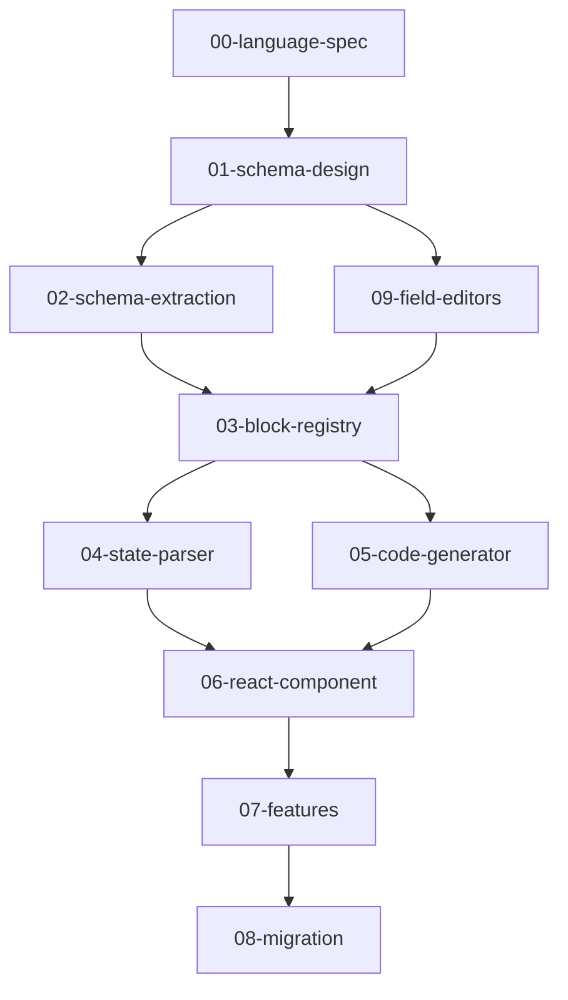

# Blockly 事件编辑器重构总览

## 目标

完全重写基于 Blockly 的事件编辑器，从 v3.x + G4 迁移到 v12 + JSON Schema。

## 当前状态

```
G4 语法文件 → Converter → MotaActionBlocks/Functions (运行时生成)
                              ↓
事件 JSON → MotaActionParser → XML → Blockly 3.x Workspace
                              ↓
                    Workspace → 代码生成 → 事件 JSON
```

## 目标状态

```
export.js → 转换脚本 → JSON Schema (编译时)
                              ↓
JSON Schema → Registry → Blockly 12 Blocks
                              ↓
事件 JSON → StateParser → JSON State → Blockly 12 Workspace
                              ↓
                    Workspace → Generator → 事件 JSON
```

## 文档索引

| 文档 | 内容 | 预估工作量 |
|------|------|------------|
| [00-language-spec.md](./00-language-spec.md) | Mota Action DSL 语言规范（四层结构） | - |
| [01-schema-design.md](./01-schema-design.md) | Block JSON Schema 类型设计 | 中 |
| [02-schema-extraction.md](./02-schema-extraction.md) | 从 export.js 转换到 JSON Schema | 中 |
| [03-block-registry.md](./03-block-registry.md) | JSON Schema → Blockly 注册器 | 中 |
| [04-state-parser.md](./04-state-parser.md) | 事件 JSON → Blockly State 转换 | 中 |
| [05-code-generator.md](./05-code-generator.md) | Blockly State → 事件 JSON 生成 | 中 |
| [06-react-component.md](./06-react-component.md) | React BlocklyWorkspace 组件 | 中 |
| [07-features.md](./07-features.md) | 交互功能（补全/右键菜单等） | 中 |
| [08-migration.md](./08-migration.md) | 迁移和清理旧代码 | 小 |
| [09-field-editors.md](./09-field-editors.md) | 字段级编辑器架构（选点/素材/预览等） | 中 |

## 依赖关系



## 编译器视角

从编译器架构理解这个重构：

| 模块 | 编译器概念 | 说明 |
|------|-----------|------|
| 00-language-spec | 语言规范 | 定义 DSL 的词法、语法、语义 |
| 01-schema-design | 语法描述格式 | JSON Schema 作为语法定义格式 |
| 02-schema-extraction | 语法提取 | 从 export.js 提取语法规则 |
| 03-block-registry | 词法分析器 | Schema → Blockly Block 注册 |
| 04-state-parser | 语法分析器 | 事件 JSON → Blockly State |
| 05-code-generator | 代码生成器 | Blockly State → 事件 JSON |
| 06-react-component | 编辑器前端 | 可视化编辑界面 |
| 09-field-editors | 终结符编辑器 | 字段级自定义编辑器（选点/素材等） |

## 关键决策

1. **基于 export.js**：使用运行时抓取的数据，而非解析 G4 文件
2. **双版本并存**：`blockly@12` (新) + `blockly-legacy` (旧)，渐进迁移
3. **JSON Schema 格式**：自定义格式，包含 Blockly 定义 + 代码生成 + 扩展特性
4. **字段级编辑器**：将块级双击行为下沉为字段级自定义编辑器，解决互斥问题
5. **复用 React Modal**：字段编辑器复用已有的 `src/Workbench/modals/` 组件
6. **完全重写**：不复用旧代码，功能对齐即可

## 验收标准

- [ ] 所有积木类型都有 JSON Schema 定义
- [ ] 能正确加载现有事件数据并显示
- [ ] 编辑后能正确生成事件 JSON
- [ ] 所有交互功能正常（补全、选点、素材选择、预览等）
- [ ] 字段级编辑器支持同一块内多种编辑器共存
- [ ] 移除 G4、Converter、旧 Blockly 相关代码
